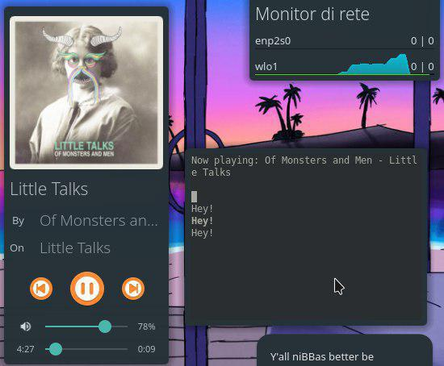

# MPRISLyrics [](https://ko-fi.com/K3K3D0E0)
Small command-line utility that displays lyrics in sync with the currently playing song in a MPRIS2 capable player.



_This screenshot is courtesy of @SantX27_

## Before you download

Please note: I am only challenging myself here, and I wanted a lyrics visualizer that can run on a terminal.

Don't spam for ETAs (eg. for a certain lyrics provider) or update requests.

If you like the idea you can always contribute to it (pull requests are VERY welcome), fork it and maintain it, rewrite it in another language.

And finally, please note that when my interest in this project will be over, it will be over. There's no way around it, sadly.

## Prerequisites

This project relies on Playerctl, a CLI tool that can remotely control MPRIS-capable players.
You can get it [here](https://github.com/acrisci/playerctl/releases/latest).

You will also need PHP (>= 7.1) and cURL extension for PHP (php-curl)

## Using the project

#### Before using MPRISLyrics, please check if your music player is listed and supported: [click here](https://github.com/AryToNeX/MPRISLyrics/blob/master/COMPATIBILITY.md) 
##### If you don't find your music player you can still test if it works and then make a PR to include it in the compatibility sheet.

### Using a packaged build (recommended)
```
mkdir MPRISLyrics && cd MPRISLyrics
wget https://github.com/AryToNeX/MPRISLyrics/releases/download/1.0.0-beta1/MPRISLyrics-1.0.0-beta1.phar -o MPRISLyrics.phar
wget https://github.com/AryToNeX/MPRISLyrics/raw/1.0.0-beta1/start.sh -o start.sh
chmod +x start.sh # if you encounter problems running the start script
./start.sh
```
### From source
```
git clone https://github.com/AryToNeX/MPRISLyrics
cd MPRISLyrics
chmod +x start.sh # if you encounter problems running the start script
./start.sh
```

## Apache 2.0 License

```
Copyright 2018 Anthony Calabretta

Licensed under the Apache License, Version 2.0 (the "License");
you may not use this file except in compliance with the License.
You may obtain a copy of the License at

    http://www.apache.org/licenses/LICENSE-2.0

Unless required by applicable law or agreed to in writing, software
distributed under the License is distributed on an "AS IS" BASIS,
WITHOUT WARRANTIES OR CONDITIONS OF ANY KIND, either express or implied.
See the License for the specific language governing permissions and
limitations under the License.
```
